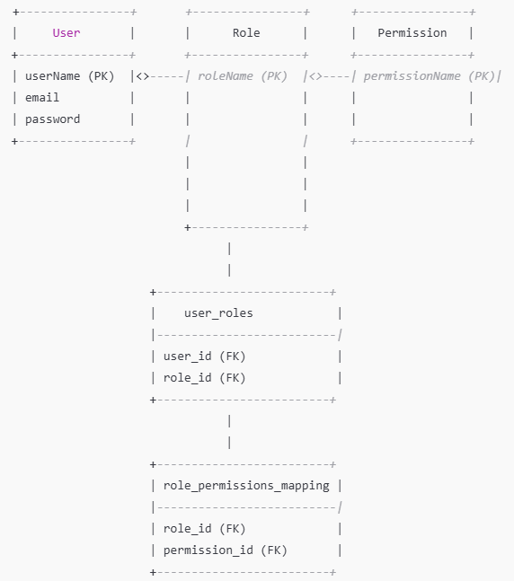

# Role-Based Access Control (RBAC) System

## Overview

This project implements a **Role-Based Access Control (RBAC)** system, enabling secure and flexible access management. It allows administrators to assign roles to users, define permissions for roles, and control access to system resources based on user roles.

## Features

- **User Authentication and Role Assignment**: Secure login and role-based user management.
- **Role-based Permission Management**: Assign specific permissions to roles.
- **Scalable Database Design**: Easily extendable database schema to accommodate growing roles, permissions, and users.
- **APIs for Authentication, Authorization, and Administration**: Expose endpoints for managing users, roles, permissions, and resources.

## Architecture

### Key Components:
1. **Users**: Individuals or systems accessing the application.
2. **Roles**: Groups defining access levels (e.g., Admin, User, Viewer).
3. **Permissions**: Actions users can perform (e.g., Read, Write, Delete).

### Relationships:
- **Users ↔ Roles**: A user can have multiple roles, and each role can be assigned to multiple users.
- **Roles ↔ Permissions**: A role can have multiple permissions, and each permission can be assigned to multiple roles.

## Database Design

This project implements **Role-Based Access Control (RBAC)** using three main entities: **User**, **Role**, and **Permission**. The relationships between these entities are modeled using join tables.

### Entities

#### `users` Table
| Column Name  | Data Type | Constraints             |
|--------------|-----------|-------------------------|
| `userName`   | `VARCHAR` | Primary Key, Unique, Not Null |
| `email`      | `VARCHAR` | Not Null                |
| `password`   | `VARCHAR` | Not Null                |

#### `roles` Table
| Column Name  | Data Type | Constraints             |
|--------------|-----------|-------------------------|
| `roleName`   | `VARCHAR` | Primary Key, Unique, Not Null |

#### `permissions` Table
| Column Name  | Data Type | Constraints             |
|--------------|-----------|-------------------------|
| `permissionName` | `VARCHAR` | Primary Key, Unique, Not Null |

#### `user_roles` Table (Join Table between Users and Roles)
| Column Name  | Data Type | Constraints                         |
|--------------|-----------|-------------------------------------|
| `user_id`    | `VARCHAR` | Foreign Key to `users(userName)`, Not Null |
| `role_id`    | `VARCHAR` | Foreign Key to `roles(roleName)`, Not Null |
| **Primary Key**: (`user_id`, `role_id`) |

#### `role_permissions_mapping` Table (Join Table between Roles and Permissions)
| Column Name  | Data Type | Constraints                         |
|--------------|-----------|-------------------------------------|
| `role_id`    | `VARCHAR` | Foreign Key to `roles(roleName)`, Not Null |
| `permission_id` | `VARCHAR` | Foreign Key to `permissions(permissionName)`, Not Null |
| **Primary Key**: (`role_id`, `permission_id`) |

### Entity Relationships

1. **User ↔ Role**: A many-to-many relationship where a user can have multiple roles, and a role can be assigned to multiple users.
2. **Role ↔ Permission**: A many-to-many relationship where a role can have multiple permissions, and a permission can be assigned to multiple roles.

## API Endpoints

### User Endpoints

- **GET /users**: Retrieve a list of all users.
- **GET /users/{userName}**: Get details of a specific user by `userName`.
- **POST /users**: Create a new user.
- **PUT /users**: Update an existing user.
- **DELETE /users/{userName}**: Delete a user by `userName`.

### Role Endpoints

- **GET /roles**: Retrieve a list of all roles.
- **GET /roles/{roleName}**: Get details of a specific role by `roleName`.
- **POST /roles**: Create a new role.
- **PUT /roles**: Update an existing role.
- **DELETE /roles/{roleName}**: Delete a role by `roleName`.

### Permission Endpoints

- **GET /permissions**: Retrieve a list of all permissions.
- **GET /permissions/{permissionName}**: Get details of a specific permission by `permissionName`.
- **POST /permissions**: Create a new permission.
- **PUT /permissions**: Update an existing permission.
- **DELETE /permissions/{permissionName}**: Delete a permission by `permissionName`.

### Linking and Unlinking Endpoints

- **POST /users/{userName}/roles/{roleName}**: Assign a role to a user.
- **DELETE /users/{userName}/roles/{roleName}**: Remove a role from a user.
- **POST /roles/{roleName}/permissions/{permissionName}**: Assign a permission to a role.
- **DELETE /roles/{roleName}/permissions/{permissionName}**: Remove a permission from a role.

## Database Schema

### Tables

1. **users Table**
   - Purpose: Stores user information.
   - Primary Key: `userName`
   - Columns:
      - `userName`: A unique identifier for the user (Primary Key).
      - `email`: Email address of the user.
      - `password`: The password of the user.

2. **roles Table**
   - Purpose: Stores role information.
   - Primary Key: `roleName`
   - Columns:
      - `roleName`: A unique identifier for the role (Primary Key).

3. **permissions Table**
   - Purpose: Stores permission information.
   - Primary Key: `permissionName`
   - Columns:
      - `permissionName`: A unique identifier for the permission (Primary Key).

4. **user_roles Table (Join Table between Users and Roles)**
   - Purpose: Models the many-to-many relationship between users and roles.
   - Primary Key: Composite key of `user_id` and `role_id`.
   - Columns:
      - `user_id`: Foreign key referencing `users(userName)`.
      - `role_id`: Foreign key referencing `roles(roleName)`.

5. **role_permissions_mapping Table (Join Table between Roles and Permissions)**
   - Purpose: Models the many-to-many relationship between roles and permissions.
   - Primary Key: Composite key of `role_id` and `permission_id`.
   - Columns:
      - `role_id`: Foreign key referencing `roles(roleName)`.
      - `permission_id`: Foreign key referencing `permissions(permissionName)`.

## Schema Diagram

Here’s a visual representation of the schema design:

## Relationships

1. **Users and Roles (Many-to-Many)**:
   - The `user_roles` join table links the `users` and `roles` tables. Each user can have multiple roles, and each role can be assigned to multiple users.

2. **Roles and Permissions (Many-to-Many)**:
   - The `role_permissions_mapping` join table links the `roles` and `permissions` tables. Each role can have multiple permissions, and each permission can be assigned to multiple roles.

This schema provides a scalable and efficient way to manage users, roles, and permissions in your application.

## Conclusion

This project demonstrates the implementation of **Role-Based Access Control (RBAC)** using Java and Spring Boot. It includes user, role, and permission management, along with many-to-many relationships for linking users to roles, roles to permissions. The database schema supports this functionality, providing an efficient way to manage access control in your application.

## Future Plans
1. **Integration with External Identity Providers (SSO)**:

---

Feel free to contribute, report issues, or suggest improvements to this project.
